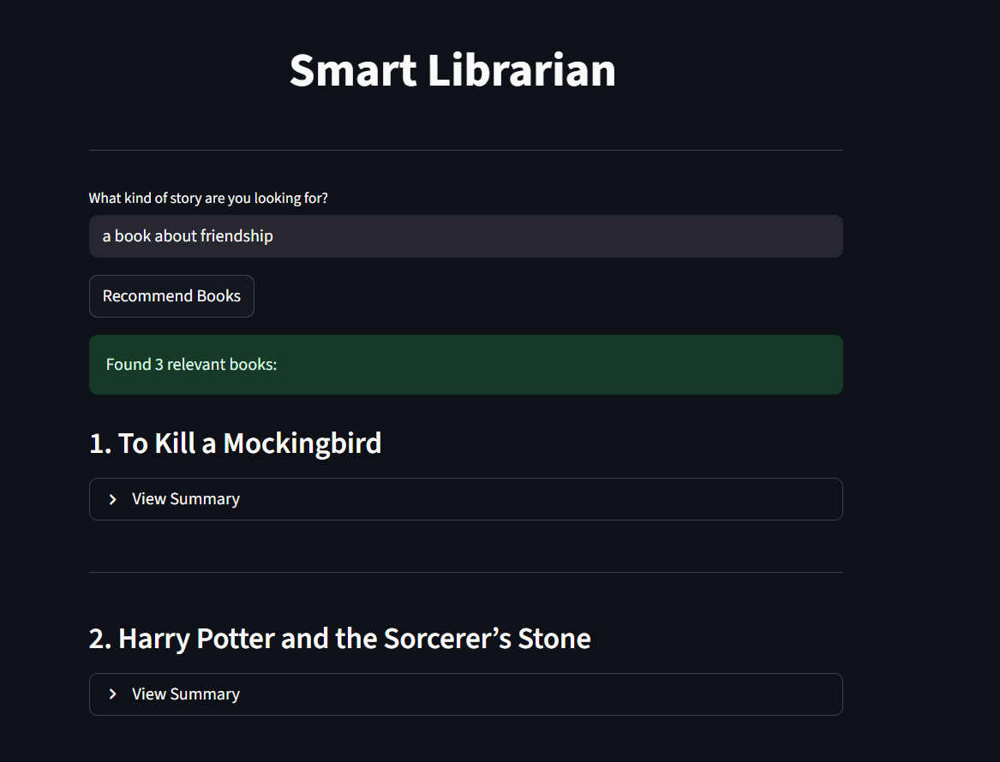

# Smart Librarian

The scope of this project was to build an AI chatbot that recommends books based on the user’s interests using OpenAI GPT combined with Retrieval-Augmented Generation (FAISS). The system ingests a curated set of book summaries, generates embeddings for semantic search, and uses a conversational flow to refine preferences in real time. For each recommendation, the chatbot then calls a separate tool to fetch a detailed, multi-paragraph summary and presents it alongside the suggestion, giving users both a tailored pick and enough context to decide what to read next.


## Table of Contents

- Project Overview[](#project-overview)
- Installation[](#installation)
- Configuration[](#configuration)
- Build the Index[](#build-the-index)
- Run the Application[](#run-the-application)
- Usage[](#usage)


## Project Overview
```

├── book_summaries_dict.py   # book summaries data source
├── build_index.py           # create embeddings + FAISS index
├── finding_book.py          # semantic search + summary expansion
├── app.py                   # Streamlit UI 
```


## Installation
Clone or download the project, then set up a virtual environment and install dependencies.

```bash
python -m venv .venv
# Windows:
.venv\Scripts\activate
# macOS / Linux:
source .venv/bin/activate

pip install --upgrade pip
pip install -r requirements.txt
```


## Configuration
Create a `.env` file in the project root:
```
OPENAI_API_KEY=sk-xxxxxxxxxxxxxxxx
```

> Ensure this key is valid and has access to the embeddings and chat endpoints you use.


## Build the Index
Generate embeddings and write the FAISS index and titles list:
```bash
python build_index.py
```
This creates:
- `book_index.faiss`
- `book_titles.json`

> Keep the **same embedding model** in indexing and querying. If you change the model, **rebuild** the index.


## Run the Application
Launch the Streamlit UI:
```bash
streamlit run app.py  
```

The application look like this:




## Usage

1. Start the app
Run **streamlit run app.py** and open the URL shown in your terminal. Then enter a description of the type of book you want like this:

    - “I want a book about war”

    - “I want a hopeful sci-fi novel”

2. Click **Recommend Books** to run the semantic search.

3. Browse the results. Each result shows the most relevant matches first. Click a result to expand it and read a four-paragraph summary for the recommended book.


