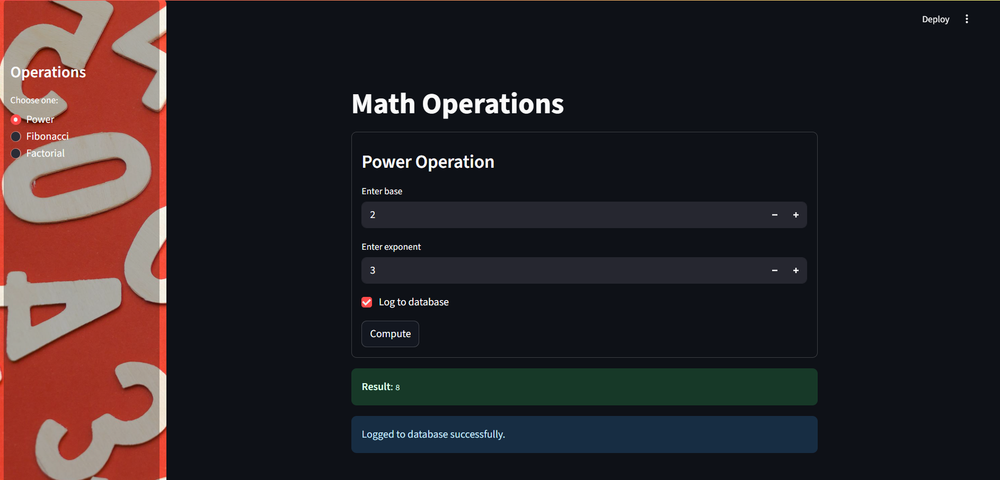

# API Microservice for Solving Mathematical Operations

In this project I create a FastAPI application that exposes endpoints for performing mathematical operations. The application supports power calculations, Fibonacci sequence and factorial computations. It uses asynchronous database operations to log each request in a SQLite database.


## Table of Contents
* [Project Structure](#project-structure)
* [Installation](#installation)
* [Run the Application](#run-the-application)
* [Endpoints](#endpoints)
  * [Power Operation](#1-power-operation)
  * [Fibonacci Sequence](#2-fibonacci-sequence)
  * [Factorial](#3-factorial)
* [Database Schema](#database-schema)
* [Error Handling](#error-handling)


## Project Structure

```
├── main.py           # Streamlit app with math logic and DB handling
├── math_utils.py     # Mathematical operation functions
├── database.py       # Database configuration and models
└── requests.db       # SQLite database (created automatically)
├── requirements.txt  # Python dependencies
└── readme.md         # Project documentation
```


## Installation

1. Clone the repository or download the files.

2. Create a virtual environment and activate it:

```bash
python -m venv venv
venv\Scripts\activate
```

3. Install dependencies:

```bash
pip install -r requirements.txt
```

## Run the Application

To launch the Streamlit app, simply run:

```bash
streamlit run main.py
```
This will open the app in your default browser at:

- [http://localhost:8501](http://localhost:8501)

The application should look like this:



## Endpoints

The API provides the following endpoints for mathematical operations:
### 1. Power Operation
**Endpoint**: `GET /power`

Calculate base raised to an exponent.

**Parameters**:
- `base` (int): The base number (max: 1,000,000)
- `exponent` (int): The exponent (max: 1,000)


### 2. Fibonacci Sequence
**Endpoint**: `GET /fibonacci`

Calculate the nth number in the Fibonacci sequence.

**Parameters**:
- `n` (int): Position in sequence (0-100,000)


### 3. Factorial
**Endpoint**: `GET /factorial`

Calculate the factorial of a non-negative integer.

**Parameters**:
- `n` (int): Non-negative integer (max: 5,000)


## Database Schema

The application automatically creates a SQLite database (`requests.db`) with the following table:

```sql
CREATE TABLE requests_log (
    id INTEGER PRIMARY KEY,
    operation VARCHAR,
    input VARCHAR,
    result VARCHAR
);
```

Each API request is logged asynchronously with:
- **id**: Unique identifier for the request
- **operation**: Type of mathematical operation
- **input**: Input parameters as string
- **result**: Calculated result as string

## Error Handling

The API returns appropriate HTTP status codes and error messages for:
- Invalid input values (negative numbers where not allowed)
- Input values exceeding limits
- Missing required parameters

